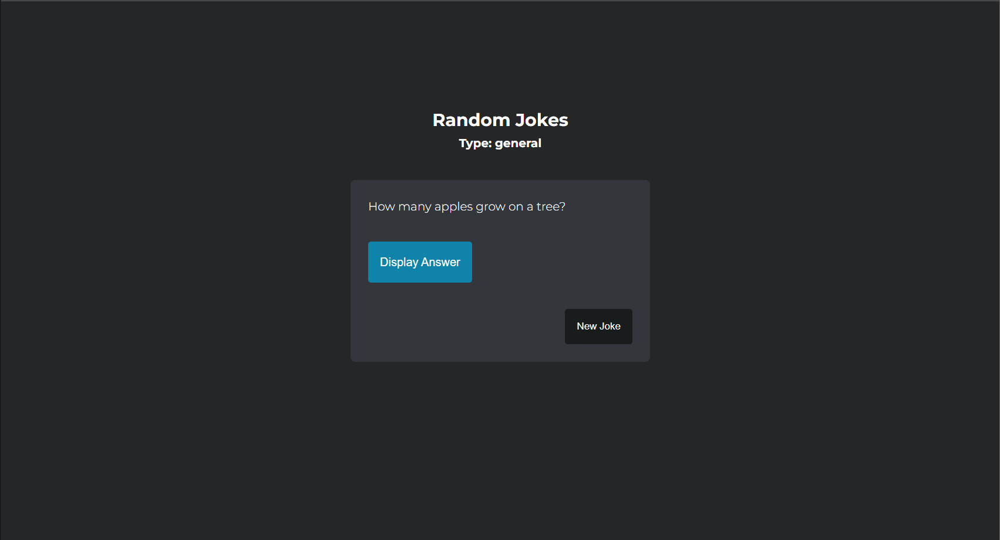
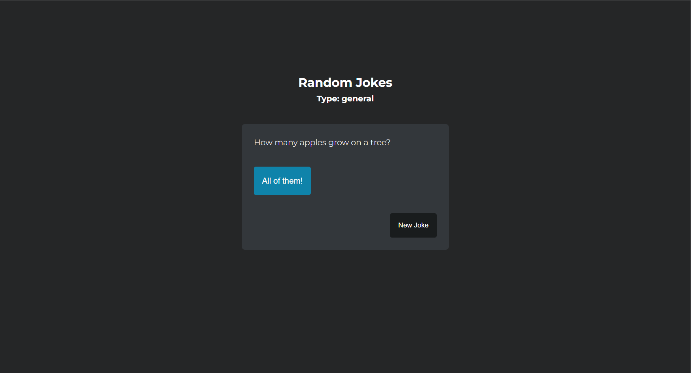

# Fathom3 Jokes Generator Coding Task

A joke generating web appplication written in EJS (front end) and Express.js (back end). 

SQLite3 v5.0.8 has been used for the implementation of the database which stores all the jokes.

## Installation / Setup

- Create a local database file named `jokes.db` in the root directory.

- Install packages using:

```bash
  npm install
```

- Application can be run with:

```bash
   $env:DEBUG='fathom3-jokes-coding-task:*'; npm start#
```
The application will then be available at http://localhost:3000/.

    
## Routes

`/` - Default application path

`/randomJoke` - Retrieves a random joke

`/joke/:id` - Retrieves a joke based on its id


## Screenshots






## License

[MIT](https://choosealicense.com/licenses/mit/)

